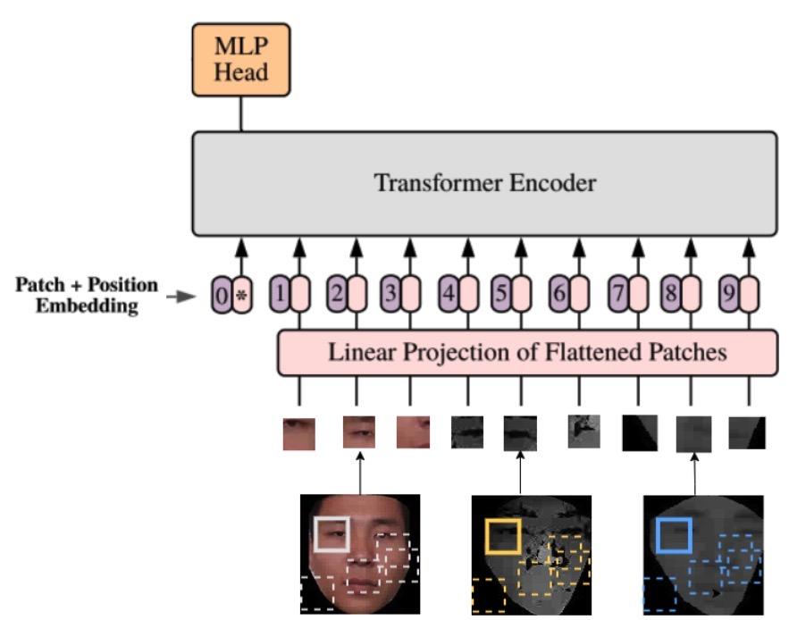

# Patch-based Methods for Face Anti-spoofing (FAS) & Code for CVPR2019 FAS Attack Detection Challenge

This is the source code for 2nd palce solution to the [ChaLearn Face Anti-spoofing Attack Detection Challenge](https://sites.google.com/qq.com/face-anti-spoofing/winners-results/challengecvpr2019) hosted by ChaLearn. 


## Recent Update

**`2021.11.24`**: Add ViT for patch-based FAS

**`2021.10.12`**: Add VisionPermutator, MLPMixer and ConvMixer for patch-based FAS

**`2019.3.10`**: Code upload for the origanizers to reproduce. 

#### Dependencies
- imgaug==0.4.0
- torch==1.9.0
- torchvision==0.10.0

#### Pretrained models

download [\[models.2021\]](https://drive.google.com/file/d/1ygfWYrNacHZFKisIvuqzNcO0Nq3zzf-4/view?usp=sharing)

#### CASIA-SURF validation score (ACER)


| Single-modal Model                 | Color  | Depth  | ir     |
| --------------------- | ------ | ------ | ------ |
| FaceBagNet            | 0.0672 | 0.0036 | 0.1003 |
| ConvMixer             | 0.0311 | 0.0025 | 0.1073 |
| MLPMixer              | 0.0584 | 0.0010 | 0.2382 |
| VisionPermutator(ViP) | 0.0570 | 0.0304 | 0.2571 |
| VisonTransformer(ViT) | 0.0683 | 0.0036 | 0.2799 |

| Multi-modal Model         | patch size 32 | patch size 48 | patch size 64 |
| ----------------- | ------------- | ------------- | ------------- |
| FaceBagNetFusion  | 0.0009        | 0.0006        | 0.0007        |
| ViTFusion         | 0.0169        | 0.0778        | 0.0375        |

#### Train single-modal Model
train FaceBagNet with color imgs， patch size 48：
```
CUDA_VISIBLE_DEVICES=0 python train.py --model=FaceBagNet --image_mode=color --image_size=48
```
infer
```
CUDA_VISIBLE_DEVICES=0 python train.py --mode=infer_test --model=FaceBagNet --image_mode=color --image_size=48
```

#### Train multi-modal fusion model
train FaceBagNet fusion model with multi-modal imgs， patch size 48：
```
CUDA_VISIBLE_DEVICES=0 python train_fusion.py --model=FaceBagNetFusion --image_size=48
```
infer
```
CUDA_VISIBLE_DEVICES=0 python train_fusion.py --mode=infer_test --model=FaceBagNet --image_size=48
```

## ViT for Multi-modal Face Anti-spoofing 

</img>

```
CUDA_VISIBLE_DEVICES=0 python train_fusion.py --model=ViTFusion --image_size=96 --image_patch 16
```

## Citation
If you find this work or code is helpful in your research, please cite:
```
@InProceedings{Shen_2019_CVPR_Workshops,
author = {Shen, Tao and Huang, Yuyu and Tong, Zhijun},
title = {FaceBagNet: Bag-Of-Local-Features Model for Multi-Modal Face Anti-Spoofing},
booktitle = {The IEEE Conference on Computer Vision and Pattern Recognition (CVPR) Workshops},
month = {June},
year = {2019}
}
```

## Contact
If you have any questions, feel free to E-mail me via: `taoshen.seu@gmail.com`


